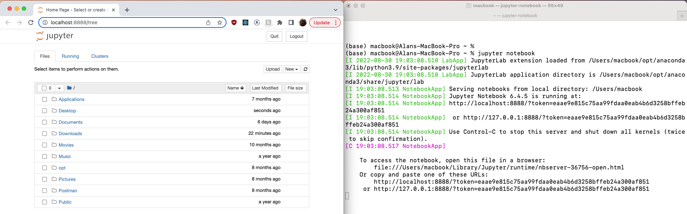

# Setup

We're going to use a version of the Python programming language called [Anaconda](https://www.anaconda.com/products/distribution#Downloads). 

To get started, follow the Anaconda installation instructions for [Windows](https://docs.anaconda.com/anaconda/install/windows/) or [macOS](https://docs.anaconda.com/anaconda/install/mac-os/). You'll need 500MB of disk space and administrator access to your computer. (Users with M1 chips on macOS should be sure to select the M1-specific Graphical Installer.)

After installation is complete, follow the appropriate instructions for your operating system:
- Windows: use Windows Search to find an application called Jupyter Notebook (with an orange icon) and open it 
- macOS: use Spotlight search to find an application called jupyter-notebook (with a black icon) and open it

A new Console (Windows) or Terminal (macOS) window should automatically pop up. At the same time, a new tab should automatically open in your default web browser with the URL `http://localhost:8888/tree`. The Terminal window should contain new output indicating that a Jupyter Notebook has been started. See the below screenshot (taken on macOS) as a reference.

Within that new Console/Terminal window, open a new tab. Then, run the command: `pip install psycopg2-binary`

Once the installation is successful, head over to your web browser which has `http://localhost:8888/tree` open. Navigate to the folder which contains `Intro to SQL and Python.ipynb` and click the file to open it in a new tab. 
